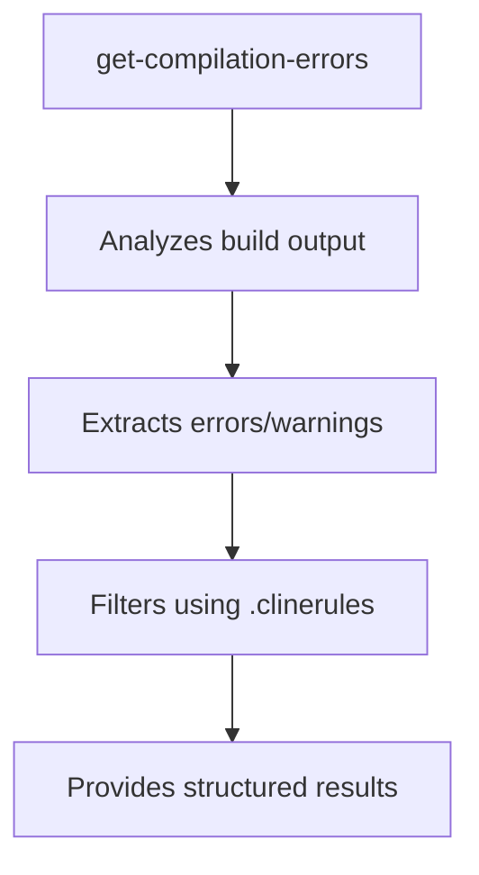

# mcp-build-toolchain MCP Server

Advanced build toolchain with compilation error analysis and filtering capabilities

The objective of the MCP is minimize use of tokens to allow LLM model to process the warning and errors of compilation process and fix.
So some build log result could result so big to be sent to model. 

Using Clinerules can send information to specific project and what to do with results.
Also can use a second file where warning and/or errors can be added to avoid the model to try to fix them.

## Key Components

### MCP Tool: get-compilation-errors



Key features:
- Processes raw compilation logs into structured data
- Integrates with .clinerules for targeted filtering
- Prioritizes critical errors first
- Generates actionable remediation steps

### .clinerules Configuration

Create `.clinerules` in project root to control error handling:

Describe how to compile and how to react to the different errors/warnings:

```markdown
- If user request to check or solve compilation errors or warnings follow to following procedure
- In case user request to compile or build use the command: build.cmd -> _Replace by user command_
- Use mcp server tool 'get-compilation-errors' to get the list of warnings and errors.
- In case the user tells file names, description or regular expression to filter the errors, create the regular expression and use the parameter 'regexp'
- After getting the errors and warnings try to fix them and compile again. Repeat the operation 5 times until no errores are reported.
- Check `docs/avoidable_errors.md` and do nothing with errors or warning reported in this file.
- (Optional): In case you want to set a default regular expression. Add here:
  - Filter by default the errors and warnings: "error:" or "warning:"
```

### Error Documentation

Maintain `docs/avoidable_errors.md` with common issues:

```markdown
## Avoidable Warnings
- W0611: Unused import → Remove unused packages
- E302: Expected 2 blank lines → Follow PEP8 spacing

## Ignorable Errors  
- E266: Too many leading '#' → Style preference
- W504: Line break after binary operator → Project-specific
```

### Prompt examples


## Configuration

```json
"mcpServers": {
  "mcp-build-toolchain": {
    "command": "uv",
    "args": [
      "--directory",
      "/Users/username/mcp/mcp-build-toolchain",  --> Folder where MCP server is installed
      "run",
      "mcp-build-toolchain"
    ],
    "tools": {
      "get-compilation-errors": {
        "outfile": "build/errors.log"
      }
    }
  }
}
```

## Quickstart

### Install

#### Claude Desktop

On MacOS: `~/Library/Application\ Support/Claude/claude_desktop_config.json`
On Windows: `%APPDATA%/Claude/claude_desktop_config.json`

<details>
  <summary>Development/Unpublished Servers Configuration</summary>
  ```
  "mcpServers": {
    "mcp-build-toolchain": {
      "command": "uv",
      "args": [
        "--directory",
        "/Users/joaquinlopez/mcp/mcp-build-toolchain",
        "run",
        "mcp-build-toolchain"
      ]
    }
  }
  ```
</details>

<details>
  <summary>Published Servers Configuration</summary>
  ```
  "mcpServers": {
    "mcp-build-toolchain": {
      "command": "uvx",
      "args": [
        "mcp-build-toolchain"
      ]
    }
  }
  ```
</details>

#### Cline

Cline: `%APPDATA%/\Roaming\Code\User\globalStorage\saoudrizwan.claude-dev\settings\cline_mcp_settings.json`


